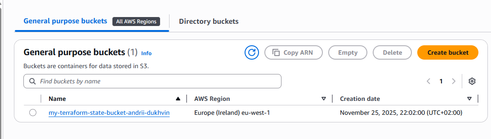
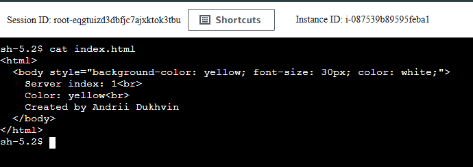
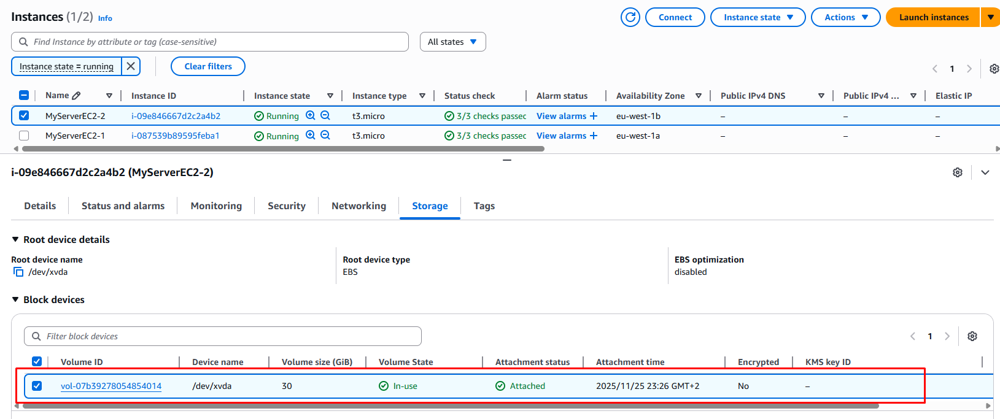
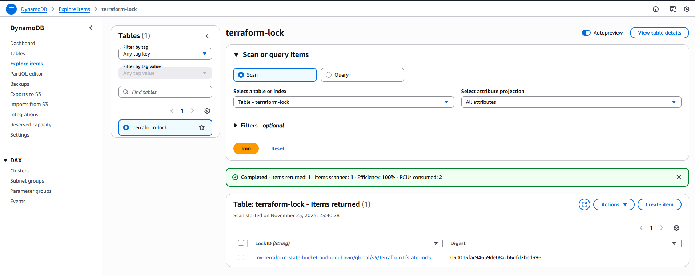

# Project Description

The project architecture includes the following components:

  * **VPC** (Virtual Private Cloud)
  * **2 x EC2 Instances**
  * **1 x Load Balancer**
  * **S3 Bucket**
  * **DynamoDB** (terraform-lock)
  * **SSM** (Amazon Web Services Systems Manager)


-----

# How to launch the project

### 1\. Configure Credentials

To run the project, export your AWS credentials:

**For Windows (PowerShell):**

```
$env:AWS_ACCESS_KEY_ID="your-access-key-id"
$env:AWS_SECRET_ACCESS_KEY="your-secret-access-key"
```

**For Linux/macOS:**

```
export AWS_ACCESS_KEY_ID="your-access-key-id"
export AWS_SECRET_ACCESS_KEY="your-secret-access-key"
```

### 2\. Initialize Remote Backend

First, launch the configuration for the remote state (S3 + DynamoDB):

```
terraform init
terraform plan
terraform apply
```

**S3 Creation Check:**
After successfully executing the commands, go to the AWS Console: **Amazon S3 \> General purpose buckets**. You should see the created bucket:

*Note:* At this stage, the bucket will be empty. The state file (`tfstate`) will appear in it only after deploying the main infrastructure.

### 3\. Deploy Main Infrastructure

Navigate to the main project directory and execute the deployment:

```
terraform init
terraform plan
terraform apply
```

**State File Check:**
After launching the project, return to the S3 bucket. The `terraform.tfstate` file should now appear there:

-----

# Project Verification

### 1\. SSM Session Manager Check

To verify the correct SSM configuration and instance access:

1.  Go to the **EC2** section.
2.  Select the created server and click **Connect**.
3.  Switch to the **Session Manager** tab and click **Connect**.

In the opened terminal, check for the presence of web server files:

```
cat /var/www/html/index.html
```

Verify that the site file is present:


### 2\. EBS Storage Check

Ensure that the additional EBS volumes were created and mounted to the servers:

### 3\. State Locking Check (DynamoDB)

Go to the **DynamoDB** \> **Tables**. The State Locking table should be located here: (State Locking):

-----

# How to test the Application

Navigate to **EC2 \> Load Balancers**, select `my-application-lb` and copy the **DNS name**.

Paste the DNS link into your browser. Refresh the page several times. You should see the background color and text change, indicating that the Load Balancer is successfully distributing traffic between different instances.


-----

# Cleanup

To remove all created resources, run:

```
terraform destroy
```

-----

### 🛠 Implemented Improvements
**Updated:** November 26, 2025

* **README:** Update readme file.
* **tf-plane:** Add terrafrom plane for main and backend.

-----

**Updated:** November 25, 2025

* **Security:** Configured **AWS SSM Session Manager** for secure instance access without opening inbound ports.
* **Hardcoded AMI:** Replaced static IDs with **`data "aws_ami"`** to automatically select the latest image.
* **State Locking:** Set up **Remote Backend (S3 + DynamoDB)** for secure state storage and locking.
* **Structure:** Split monolithic code into separate logical files.
* **Hardcoding Environment:** Moved region and network parameters to **variables** to facilitate easy switching between environments.
* **Depends_on:** Removed redundant **`depends_on`** as Terraform automatically builds the dependency graph.

