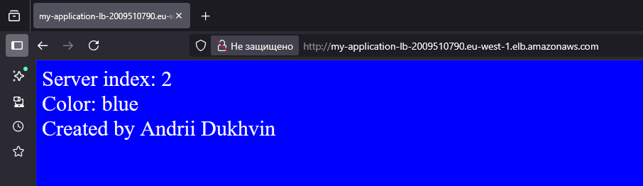
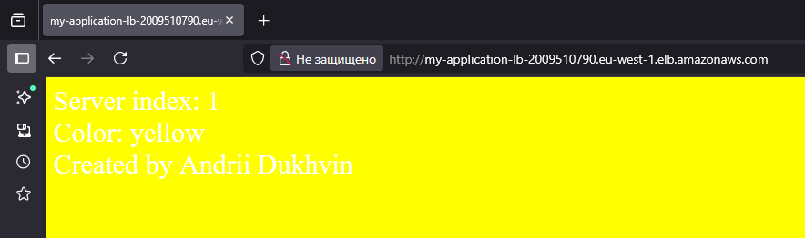

# Project Description
The architecture of the project include:

VPC (Virtual Private Cloud)
2 x EC2 Instances
1 x Load Balancer


____

# How to launch a project
To run the project, you need to add your ACCESS_KEY and SECRET_KEY.

For Windows:
```
$env:AWS_ACCESS_KEY_ID=" "
$env:AWS_SECRET_ACCESS_KEY=" "
```
Next you need to launch the terraform itself:

```
Terraform init
Terraform plan
Terraform apply
```
____

# How to test a project

Follow to EC2 > Load balancers > my-application-lb > and copy DNS name.

Next, go to your browser and paste the link. When you reload the page, you will see a new page with a different color and text each time. This means that our LB is working successfully and redirecting our traffic.







Next, we run 
```
terraform destroy 
```
so that aws doesn't eat up money.